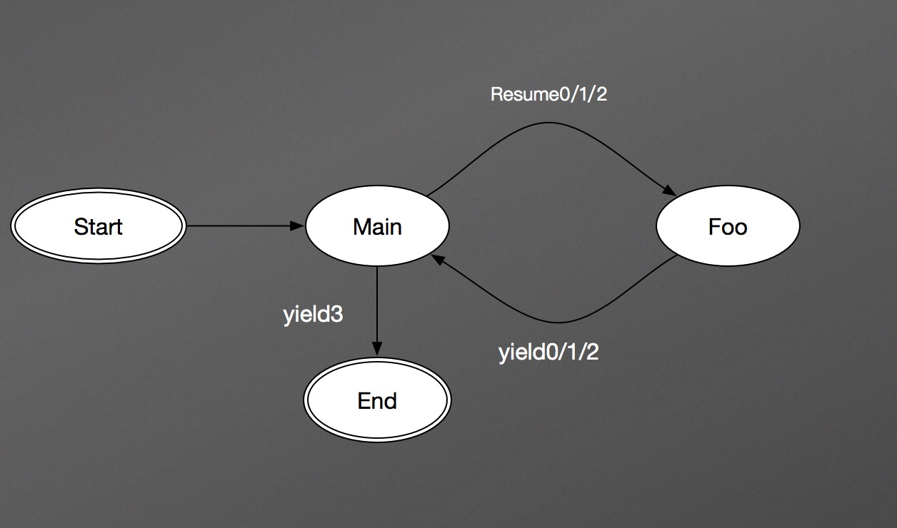
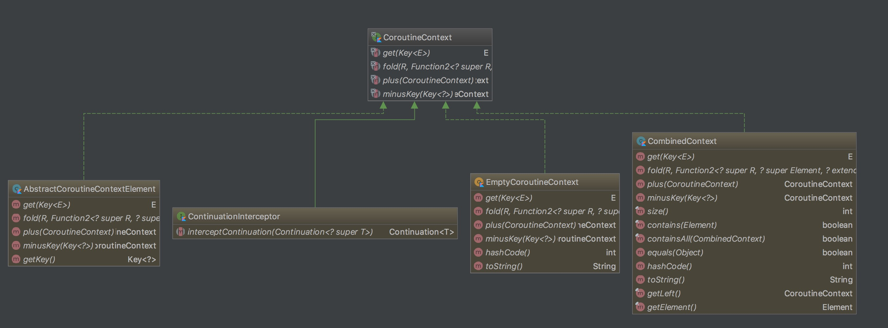

# 深入理解 Kotlin Coroutine （一）

本文主要介绍 Kotlin Coroutine 的基础 API，有关 Kotlinx.Coroutine 的内容，我们将在下一期给大家介绍。由于本人水平有限，如果大家有什么异议，欢迎直接抛出来跟我讨论~

## 1. 什么是 Coroutine

Coroutine 被翻译成了“协程”，意思就是要各个子任务协作运行的意思，所以大家一下就明白了它被创造出来是要解决异步问题的。

我们写 Java 的程序员，对线程更熟悉一些。线程是比进程更小一级的运行单位，它的调度由操作系统来完成，所以我们只管 new Thread 和 start，至于什么时候 run，什么时候 run 完，我们都没办法预见。

```java
 Thread t = new Thread(task); 
 t.start(); 
```
尽管有诸多不可控的因素，不过我们可以肯定的是起了一个新的线程并启动它之后，当前线程并不会受到阻塞。如果大家再往深处想想，CPU 在任意时刻运行什么进程及其线程，是操作系统决定的，但归根结底一个单线程的 CPU 在任一时刻只能运行一个任务。

那么协程呢？协程的调度是应用层完成的，比如我们说 Lua 支持协程，那么各个协程如何运行，这一调度工作实际上是 Lua 自己的虚拟机来完成的。这个调度与线程调度有着比较大的差别，线程调度是抢占式调度，很有可能线程 A 运行得美滋滋的，线程 B 突然把 CPU 抢过来，跟 A 说“你给我下去吧你”，于是线程 A 只能干瞪眼没办法；而协程的调度是非抢占式的，目前常见的各种支持协程的语言实现中都有 yield 关键字，它有“妥协、退让”的意思，如果一个协程执行到一段代码需要歇会儿，那么它将把执行权让出来，如果它不这么做，没人跟它抢。

在 接触 Kotlin 的协程之前呢，我们先给大家看一个 Lua 的例子，比较直观：

```lua
 function foo(a) 
     print("foo", a) 
     return coroutine.yield(2 * a) 
 end 
 　 
 co = coroutine.create(function ( a, b ) 
     print("co-body", a, b) 
     local r = foo(a + 1) 
     print("co-body", r) 
     local r, s = coroutine.yield(a + b, a - b) 
     print("co-body", r, s) 
     return b, "end" 
 end) 
 　 
 print("main", coroutine.resume(co, 1, 10)) 
 print("main", coroutine.resume(co, "r")) 
 print("main", coroutine.resume(co, "x", "y")) 
 print("main", coroutine.resume(co, "x", "y")) 
```
运行结果如下：

```
 co-body	1	10 
 foo	2 
 main	true	4 
 co-body	r 
 main	true	11	-9 
 co-body	x	y 
 main	true	10	end 
 main	false	cannot resume dead coroutine 
```
首先定义了一个 foo 函数，然后创建 coroutine，创建了之后还需要调用 resume 才能执行协程，运行过程是谦让的，是交替的：



**图中数字表示第n次**

协程为我们的程序提供了一种暂停的能力，就好像状态机，只有等到下一次输入，它才做状态转移。显然，用协程来描述一个状态机是再合适不过的了。

也许大家对 lua 的语法不是很熟悉，不过没关系，上面的例子只需要知道大概是在干什么就行：这例子就好像，main 和 Foo 在交替干活，有点儿像 A B 两个人分工协作，A 干一会儿 B 来，B 干一会儿，再让 A 来一样。如果我们用线程来描述这个问题，那么可能会用到很多回调，相信写 Js 的兄弟听到这儿要感到崩溃了，因为 Js 的代码写着写着就容易回调满天飞，业务逻辑的实现越来越抽象，可读性越来越差；而用协程的话，就好像一个很平常的同步操作一样，一点儿异步任务的感觉都没有。

我们前面提到的协程的非抢占调度方式，以及这个交替执行代码的例子，基本上可以说明协程实际上致力于用同步一样的代码来完成异步任务的运行。

一句话，有了协程，你的异步程序看起来就像同步代码一样。

## 2. Kotlin 协程初体验

Kotlin 1.1 对协程的基本支持都在 Kotlin 标准库当中，主要涉及两个类和几个包级函数和扩展方法：

* CoroutineContext，协程的上下文，这个上下文可以是多个的组合，组合的上下文可以通过 key 来获取。EmptyCoroutineContext 是一个空实现，没有任何功能，如果我们在使用协程时不需要上下文，那么我们就用这个对象作为一个占位即可。上下文这个东西，不管大家做什么应用，总是能遇到，比如 Android 里面的 Context，JSP 里面的 PageContext 等等，他们扮演的角色都大同小异：资源管理，数据持有等等，协程的上下文也基本上是如此。
  

* Continuation，顾名思义，继续、持续的意思。我们前面说过，协程提供了一种暂停的能力，可继续执行才是最终的目的，Continuation 有两个方法，一个是 resume，如果我们的程序没有任何异常，那么直接调用这个方法并传入需要返回的值；另一个是 resumeWithException，如果我们的程序出了异常，那我们可以通过调用这个方法把异常传递出去。
  

* 协程的基本操作，包括创建、启动、暂停和继续，继续的操作在 Continuation 当中，剩下的三个都是包级函数或扩展方法：
  

这几个类和函数其实与我们前面提到的 Lua 的协程 API 非常相似，都是协程最基础的 API。

除此之外，Kotlin 还增加了一个关键字：suspend，用作修饰会被暂停的函数，被标记为 suspend 的函数只能运行在协程或者其他 suspend 函数当中。

好，介绍完这些基本概念，让我们来看一个例子：

```kotlin
 fun main(args: Array<String>) { 
     log("before coroutine") 
     //启动我们的协程 
     asyncCalcMd5("test.zip") { 
         log("in coroutine. Before suspend.") 
         //暂停我们的线程，并开始执行一段耗时操作 
         val result: String = suspendCoroutine { 
             continuation -> 
             log("in suspend block.") 
             continuation.resume(calcMd5(continuation.context[FilePath]!!.path)) 
             log("after resume.") 
         } 
         log("in coroutine. After suspend. result = $result") 
     } 
     log("after coroutine") 
 } 
 　 
 /** 
  * 上下文，用来存放我们需要的信息，可以灵活的自定义 
  */ 
 class FilePath(val path: String): AbstractCoroutineContextElement(FilePath){ 
     companion object Key : CoroutineContext.Key<FilePath> 
 } 
 　 
 fun asyncCalcMd5(path: String, block: suspend () -> Unit) { 
     val continuation = object : Continuation<Unit> { 
         override val context: CoroutineContext 
             get() = FilePath(path) 
 　 
         override fun resume(value: Unit) { 
             log("resume: $value") 
         } 
 　 
         override fun resumeWithException(exception: Throwable) { 
             log(exception.toString()) 
         } 
     } 
     block.startCoroutine(continuation) 
 } 
 　 
 fun calcMd5(path: String): String{ 
     log("calc md5 for $path.") 
     //暂时用这个模拟耗时 
     Thread.sleep(1000) 
     //假设这就是我们计算得到的 MD5 值 
     return System.currentTimeMillis().toString() 
 } 
```
这段程序在模拟计算文件的 Md5 值。我们知道，文件的 Md5 值计算是一项耗时操作，所以我们希望启动一个协程来处理这个耗时任务，并在任务运行结束时打印出来计算的结果。

我们先来一段一段分析下这个示例：

```kotlin
 /** 
  * 上下文，用来存放我们需要的信息，可以灵活的自定义 
  */ 
 class FilePath(val path: String): AbstractCoroutineContextElement(FilePath){ 
     companion object Key : CoroutineContext.Key<FilePath> 
 } 
```
我们在计算过程中需要知道计算哪个文件的 Md5，所以我们需要通过上下文把这个路径传入协程当中。如果有多个数据，也可以一并添加进去，在运行当中，我们可以通过 Continuation 的实例拿到上下文，进而获取到这个路径：

```kotlin
 continuation.context[FilePath]!!.path 
```

接着，我们再来看下 Continuation：

```kotlin
 val continuation = object : Continuation<Unit> { 
     override val context: CoroutineContext 
         get() = FilePath(path) 
 　 
     override fun resume(value: Unit) { 
         log("resume: $value") 
     } 
 　 
     override fun resumeWithException(exception: Throwable) { 
         log(exception.toString()) 
     } 
 } 
```
我们除了给定了 FilePath 这样一个上下文之外就是简单的打了几行日志，比较简单。这里传入的 Continuation 当中的 resume 和 resumeWithException 只有在协程最终执行完成后才会被调用，这一点需要注意一下，也正是因为如此，startCoroutine 把它叫做 completion：

```kotlin
 public fun <T> (suspend  () -> T).startCoroutine(completion: Continuation<T> 
```

那么下面我们看下最关键的这段代码：

```kotlin
 asyncCalcMd5("test.zip") { 
     log("in coroutine. Before suspend.") 
     //暂停我们的协程，并开始执行一段耗时操作 
     val result: String = suspendCoroutine { 
         continuation -> 
         log("in suspend block.") 
         continuation.resume(calcMd5(continuation.context[FilePath]!!.path)) 
         log("after resume.") 
     } 
     log("in coroutine. After suspend. result = $result") 
 } 
```
suspendCoroutine 这个方法将外部的代码执行权拿走，并转入传入的 Lambda 表达式中，而这个表达式当中的操作就对应异步的耗时操作了，在这里我们“计算”出了 Md5 值，接着调用 ```continuation.resume``` 将结果传了出去，传给了谁呢？传给了 suspendCoroutine 的返回值也即 result，这时候协程继续执行，打印 result 结束。

下面就是运行结果了：

```
 2017-01-30T06:43:52.284Z [main] before coroutine 
 2017-01-30T06:43:52.422Z [main] in coroutine. Before suspend. 
 2017-01-30T06:43:52.423Z [main] in suspend block. 
 2017-01-30T06:43:52.423Z [main] calc md5 for test.zip. 
 2017-01-30T06:43:53.426Z [main] after resume. 
 2017-01-30T06:43:53.427Z [main] in coroutine. After suspend. result = 1485758633426 
 2017-01-30T06:43:53.427Z [main] resume: 1485758633426 
 2017-01-30T06:43:53.427Z [main] after coroutine 
```
细心的读者肯定一看就发现，所谓的异步操作是怎么个异步法？从日志上面看，明明上面这段代码就是顺序执行的嘛，不然 after coroutine 这句日志为什么非要等到最后才打印？

还有，整个程序都只运行在了主线程上，我们的日志足以说明这一点了，根本没有异步嘛。难道说协程就是一个大骗子？？

## 3. 实现异步

这一部分我们就要回答上一节留下的问题。不过在此之前，我们再来回顾一下协程存在的意义：让异步代码看上去像同步代码，直接自然易懂。至于它如何做到这一点，可能各家的语言实现各有不同，但协程给人的感觉更像是底层并发 API（比如线程）的语法糖。当然，如果你愿意，我们通常所谓的线程也可以被称作操作系统级 API 的语法糖了吧，毕竟各家语言对于线程的实现也各有不同，这个就不是我们今天要讨论的内容了。

不管怎么样，你只需要知道，协程的异步需要依赖比它更底层的 API 支持，那么在 Kotlin 当中，这个所谓的底层 API 就非线程莫属了。

知道了这一点，我们就要考虑想办法来把前面的示例完善一下了。

首先我们实例化一个线程池：

```kotlin
 private val executor = Executors.newSingleThreadScheduledExecutor { 
     Thread(it, "scheduler") 
 } 
```

接着我们把计算 Md5 的部分交给线程池去运行：

```kotlin
 asyncCalcMd5("test.zip") { 
     log("in coroutine. Before suspend.") 
     //暂停我们的线程，并开始执行一段耗时操作 
     val result: String = suspendCoroutine { 
         continuation -> 
         log("in suspend block.") 
         executor.submit { 
             continuation.resume(calcMd5(continuation.context[FilePath]!!.path)) 
             log("after resume.") 
         } 
     } 
     log("in coroutine. After suspend. result = $result") 
     executor.shutdown() 
 } 
```

那么结果呢？

```
 2017-01-30T07:18:04.496Z [main] before coroutine 
 2017-01-30T07:18:04.754Z [main] in coroutine. Before suspend. 
 2017-01-30T07:18:04.757Z [main] in suspend block. 
 2017-01-30T07:18:04.765Z [main] after coroutine 
 2017-01-30T07:18:04.765Z [scheduler] calc md5 for test.zip. 
 2017-01-30T07:18:05.769Z [scheduler] in coroutine. After suspend. result = 1485760685768 
 2017-01-30T07:18:05.769Z [scheduler] resume: 1485760685768 
 2017-01-30T07:18:05.769Z [scheduler] after resume. 
```
我们看到在协程被暂停的那一刻，协程外面的代码被执行了。一段时间之后，协程被继续执行，打印结果。

截止到现在，我们用协程来实现异步操作的功能已经实现。

你可能要问，如果我们想要完成异步操作，直接用线程池加回调岂不更直接简单，为什么要用协程呢，搞得代码这么让人费解不说，也没有变的很简单啊。

说的对，如果我们实际当中把协程的代码都写成这样，肯定会被蛋疼死，我前面展示给大家的，是 Kotlin 标准库当中最为基础的 API，看起来非常的原始也是理所应当的，如果我们对其加以封装，那效果肯定大不一样。

除此之外，在高并发的场景下，多个协程可以共享一个或者多个线程，性能可能会要好一些。举个简单的例子，一台服务器有 1k 用户与之连接，如果我们采用类似于 Tomcat 的实现方式，一个用户开一个线程去处理请求，那么我们将要开 1k 个线程，这算是个不小的数目了；而我们如果使用协程，为每一个用户创建一个协程，考虑到同一时刻并不是所有用户都需要数据传输，因此我们并不需要同时处理所有用户的请求，那么这时候可能只需要几个专门的 IO 线程和少数来承载用户请求对应的协程的线程，只有当用户有数据传输事件到来的时候才去相应，其他时间直接挂起，这种事件驱动的服务器显然对资源的消耗要小得多。

## 4. 进一步封装

这一节的内容较多的参考了 Kotlin 官方的 [Coroutine Example](images/https://github.com/Kotlin/kotlin-coroutines)，里面有更多的例子，大家可以参考学习。

### 4.1 异步

刚才那个示例让我们感觉到，写个协程调用异步代码实在太原始了，所以我们决定对它做一下封装。如果我们能在调用 suspendCoroutine 的时候直接把后面的代码拦截，并切到线程池当中执行，那么我们就不用每次自己搞一个线程池来做这事儿了，嗯，让我们研究下有什么办法可以做到这一点。

拦截。。。怎么拦截呢？

```kotlin
 public interface ContinuationInterceptor : CoroutineContext.Element { 
     companion object Key : CoroutineContext.Key<ContinuationInterceptor> 
 　 
     public fun <T> interceptContinuation(continuation: Continuation<T>): Continuation<T> 
 } 
```
我们发现，Kotlin 的协程 API 当中提供了这么一个拦截器，可以把协程的操作拦截，传入的是原始的 Continuation，返回的是我们经过线程切换的 Continuation，这样就可以实现我们的目的了。

```kotlin
 open class Pool(val pool: ForkJoinPool)  
 	: AbstractCoroutineContextElement(ContinuationInterceptor),  
 	ContinuationInterceptor { 
 　 
     override fun <T> interceptContinuation(continuation: Continuation<T>) 
     	: Continuation<T> = 
         PoolContinuation(pool,  
         	//下面这段代码是要查找其他拦截器，并保证能调用它们的拦截方法 
 	        continuation.context.fold(continuation, { cont, element -> 
 	            if (element != this@Pool && element is ContinuationInterceptor) 
 	                element.interceptContinuation(cont) else cont 
 	        })) 
 } 
 　 
 private class PoolContinuation<T>( 
         val pool: ForkJoinPool, 
         val continuation: Continuation<T> 
 ) : Continuation<T> by continuation { 
     override fun resume(value: T) { 
         if (isPoolThread()) continuation.resume(value) 
         else pool.execute { continuation.resume(value) } 
     } 
 　 
     override fun resumeWithException(exception: Throwable) { 
         if (isPoolThread()) continuation.resumeWithException(exception) 
         else pool.execute { continuation.resumeWithException(exception) } 
     } 
 　 
     fun isPoolThread(): Boolean = (Thread.currentThread() as? ForkJoinWorkerThread)?.pool == pool 
 } 
```

这个 Pool 是什么鬼？我们让它继承 AbstractCoroutineContextElement 表明它其实就是我们需要的上下文。实际上这个上下文可以给任意协程使用，于是我们再定义一个 object：

```kotlin
 object CommonPool : Pool(ForkJoinPool.commonPool()) 
```

有了这个，我们就可以把没加线程池的版本改改了：

```kotlin
 fun main(args: Array<String>) { 
     log("before coroutine") 
     //启动我们的协程 
     asyncCalcMd5("test.zip") { 
         ... 
     } 
     log("after coroutine") 
     //加这句的原因是防止程序在协程运行完之前停止 
     CommonPool.pool.awaitTermination(10000, TimeUnit.MILLISECONDS) 
 } 
 　 
 ... 
 　 
 fun asyncCalcMd5(path: String, block: suspend () -> String) { 
     val continuation = object : Continuation<String> { 
         override val context: CoroutineContext 
         	//注意这个写法，上下文可以通过 + 来组合使用 
             get() = FilePath(path) + CommonPool 
 　 
         ... 
     } 
     block.startCoroutine(continuation) 
 } 
 　 
 ... 
```

那么运行结果呢？

```
 2017-01-30T09:13:11.183Z [main] before coroutine 
 2017-01-30T09:13:11.334Z [main] after coroutine 
 2017-01-30T09:13:11.335Z [ForkJoinPool.commonPool-worker-1] in coroutine. Before suspend. 
 2017-01-30T09:13:11.337Z [ForkJoinPool.commonPool-worker-1] in suspend block. 
 2017-01-30T09:13:11.337Z [ForkJoinPool.commonPool-worker-1] calc md5 for test.zip. 
 2017-01-30T09:13:12.340Z [ForkJoinPool.commonPool-worker-1] after resume. 
 2017-01-30T09:13:12.341Z [ForkJoinPool.commonPool-worker-1] in coroutine. After suspend. result = 1485767592340 
 2017-01-30T09:13:12.341Z [ForkJoinPool.commonPool-worker-1] resume: 1485767592340 
```
我们看到程序已经非常完美的实现异步调用。显然，这种写法要比线程池回调的写法看上去顺理成章得多。

### 4.2 启动协程

在讨论完异步的封装后，有人肯定还是会提出新问题：启动协程的写法是不是有点儿啰嗦了啊？没错，每次构造一个 Continuation，也没干多少事儿，实在没什么必要，干脆封装一个通用的版本得了：

```kotlin
 class StandaloneCoroutine(override val context: CoroutineContext): Continuation<Unit> { 
     override fun resume(value: Unit) {} 
 　 
     override fun resumeWithException(exception: Throwable) { 
     	//处理异常 
         val currentThread = Thread.currentThread() 
         currentThread.uncaughtExceptionHandler.uncaughtException(currentThread, exception) 
     } 
 } 
```
这样就好办了，我们每次启动协程只需要针对当前协程提供特定的上下文即可，那么我们是不是再把启动的那个函数改改呢？

```kotlin
 fun launch(context: CoroutineContext, block: suspend () -> Unit) = 
         block.startCoroutine(StandaloneCoroutine(context)) 
```

有了这个，我们前面的代码就可以进一步修改：

```kotlin
 fun main(args: Array<String>) { 
     log("before coroutine") 
     //启动我们的协程 
     launch(FilePath("test.zip") + CommonPool) { 
         log("in coroutine. Before suspend.") 
         //暂停我们的线程，并开始执行一段耗时操作 
         val result: String = suspendCoroutine { 
             continuation -> 
             log("in suspend block.") 
             continuation.resume(calcMd5(continuation.context[FilePath]!!.path)) 
             log("after resume.") 
         } 
         log("in coroutine. After suspend. result = $result") 
     } 
     log("after coroutine") 
     CommonPool.pool.awaitTermination(10000, TimeUnit.MILLISECONDS) 
 } 
 　 
 /** 
  * 上下文，用来存放我们需要的信息，可以灵活的自定义 
  */ 
 class FilePath(val path: String) : AbstractCoroutineContextElement(Key) { 
     companion object Key : CoroutineContext.Key<FilePath> 
 } 
 fun calcMd5(path: String): String { 
     log("calc md5 for $path.") 
     //暂时用这个模拟耗时 
     Thread.sleep(1000) 
     //假设这就是我们计算得到的 MD5 值 
     return System.currentTimeMillis().toString() 
 } 
```

运行结果自然也没什么好说的。

### 4.3 暂停协程

暂停协程这块儿也太乱了，看着莫名其妙的，能不能直白一点儿呢？其实我们的代码不过是想要获取 Md5 的值，所以如果能写成下面这样就好了：

```kotlin
 val result = calcMd5(continuation.context[FilePath]!!.path).await() 
```
毋庸置疑，这肯定是可以的。想一下，有哪个类可以支持我们直接阻塞线程，等到获取到结果之后再返回呢？当然是 Future 了。

```kotlin
 suspend fun <T> CompletableFuture<T>.await(): T { 
     return suspendCoroutine { 
         continuation -> 
         whenComplete { result, e -> 
             if (e == null) continuation.resume(result) 
             else continuation.resumeWithException(e) 
         } 
     } 
 } 
```

我们干脆就直接给 CompletableFuture 定义一个扩展方法，当中只是用来挂起协程，并在结果拿到之后继续执行协程。这样，我们的代码可以进一步修改：

```kotlin
 fun main(args: Array<String>) { 
     log("before coroutine") 
     //启动我们的协程 
     val coroutineContext = FilePath("test.zip") + CommonPool 
     launch(coroutineContext) { 
         log("in coroutine. Before suspend.") 
         //暂停我们的线程，并开始执行一段耗时操作 
         val result: String = calcMd5(coroutineContext[FilePath]!!.path).await() 
         log("in coroutine. After suspend. result = $result") 
     } 
     log("after coroutine") 
     CommonPool.pool.awaitTermination(10, TimeUnit.SECONDS) 
 } 
 　 
 fun calcMd5(path: String): CompletableFuture<String> = CompletableFuture.supplyAsync { 
     log("calc md5 for $path.") 
     //暂时用这个模拟耗时 
     Thread.sleep(1000) 
     //假设这就是我们计算得到的 MD5 值 
     System.currentTimeMillis().toString() 
 } 
 　 
 ... 省略掉一些没有修改的代码 ...  
```

### 4.4 带有 Receiver 的协程

不知道大家注意到没有， 4.3 的代码中有个地方比较别扭：

```kotlin
 val coroutineContext = FilePath("test.zip") + CommonPool 
 launch(coroutineContext) { 
 	... 
 	//在协程内部想要访问上下文居然需要用到外部的变量 
     val result: String = calcMd5(coroutineContext[FilePath]!!.path).await() 
 	... 
 } 
```

在协程内部想要访问上下文居然需要用到外部的变量。这个上下文毕竟是协程自己的，自己居然没有办法直接获取到，一点儿都不自然。

其实这也不是没有办法，startCoroutine 其实还有一个带 receiver 的版本：

```kotlin
 public fun <R, T> (suspend R.() -> T).startCoroutine( 
         receiver: R, 
         completion: Continuation<T> 
```
也就是说，我们不仅可以传入一个独立的函数作为协程的代码块，还可以将一个对象的方法传入，也就是说，我们完全可以在启动协程的时候为它指定一个 receiver：

```kotlin
 fun <T> launch( 
 	receiver: T,  
 	context: CoroutineContext,  
 	block: suspend T.() -> Unit)  
 	= block.startCoroutine(receiver, StandaloneCoroutine(context)) 
```
我们修改了 launch，加入了 receiver，于是我们的代码也可以这么改：

```kotlin
 val coroutineContext = FilePath("test.zip") + CommonPool 
 //需要传入 receiver 
 launch(coroutineContext, coroutineContext) { 
 	... 
 	//注意下面直接用 this 来获取路径 
     val result: String = calcMd5(this[FilePath]!!.path).await() 
 	... 
 } 
```
如果你觉得绝大多数情况下 receiver 都会是上下文那么上面的代码还可以接着简化：

```kotlin
 fun launchWithContext( 
 	context: CoroutineContext,  
 	block: suspend CoroutineContext.() -> Unit)  
 	= launch(context, context, block) 
```

```kotlin
 launchWithContext(FilePath("test.zip") + CommonPool) { 
     log("in coroutine. Before suspend.") 
     //暂停我们的线程，并开始执行一段耗时操作 
     val result: String = calcMd5(this[FilePath]!!.path).await() 
     log("in coroutine. After suspend. result = $result") 
 } 
```

截止到现在，我们对最初的代码做了各种封装，这些封装后的代码可以在各种场景下直接使用，于是我们的协程代码也得到了大幅简化。另外，不知道大家有没有注意到，协程当中异常的处理也要比直接用线程写回调的方式容易的多，我们只需要在 Continuation 当中覆写 resumeWithException 方法就可以做到这一点。

## 5. 拿来主义：Kotlinx.Coroutine

[Kotlinx.Coroutine](images/https://github.com/Kotlin/kotlinx.coroutines) 是官方单独发出来的一个 Coroutine 的库，这个库为什么没有随着标准库一并发出来，想必大家从其包名就能略窥一二：```kotlinx.coroutines.experimental```，experimental，还处于试验阶段。不过既然敢随着 1.1 Beta 一并发出来，也说明后面的大方向不会太远，大家可以直接开始尝试其中的 API 了。

应该说，Kotlinx.Coroutine 做的事情跟我们在上一节做的事情是相同的，只不过它在这个方向上面走的更远。有关它的一些用法和细节，我们将在下一期给大家介绍。

## 6. 小结

本文主要对 Kotlin 1.1Beta 标准库的 Coroutine API 做了介绍，也给出了相应的示例向大家展示 Coroutine 能为我们带来什么。

协程是干什么的？是用来让异步代码更具表现力的。如果运用得当，它将让我们免于回调嵌套之苦，并发加锁之痛，使我们能够利用我们有限的时间写出更有魅力的程序。


